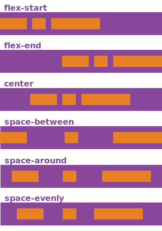

# CSS Flexbox

## Goals
* Understand what flexbox is and how it can be used for responsive styling
* Utilize flexbox to style a page

## Keywords
* Selectors
* Combinators
* Type
* Class
* ID

## Resources

* [CSS Flexbox - MDN](https://developer.mozilla.org/en-US/docs/Learn/CSS/CSS_layout/Flexbox)
* [CSS Flexbox - W3Schools](https://www.w3schools.com/css/css3_flexbox.asp)
* [CSS Flexbox Guide - CSS Tricks (**BEST!!!!**)](https://css-tricks.com/snippets/css/a-guide-to-flexbox/)

## Lesson

## Flexbox

When you use most websites, changing the size of your browser window will change the size of the elements on the page. Let's go to [The New York Times](https://www.nytimes.com) and resize the page. What happens to the content? It _adjusts_ to the size of our window! This is called a _responsive design_ and is important in making a positive user experience. Right now, our test.html page is one narrow column of content. This works because we don't have too much going on but what happens when we start adding more and more content? The column grows longer and longer. We want a want to display our information so that it's more like the New York Times--it fills the entire window but if the window gets smaller, the content responds.

CSS has several built-in tools for creating a responsive page but Flexbox is a personal favorite because it is powerful and simple. A great place to dip your toes in the responsive pond! 

### Flexbox Container

Flexbox works by having a **parent container** which holds **items**. The parent container is responsive to the size of the browser window and tells the items how to arrange themselves. The parent container is responsible for holding _all_ flexbox logic--so we don't have to tell the items inside the parent container (the child elements) what to do because the parent container does it for us.

In your test.html file, we are going to wrap **all** our `body` content in a `div` with classname `flex-container` by putting an opening `div` tag right under the opening `body` tag and the closing `div` tag right above the closing `div` tag. Then you are going to **add the class** `flex-item` to each child `div`, like so:

```html
<body>
<div class="flex-container"> <!-- ADD OPENING TAG -->
  
  <div class="flex-item"> <!-- ADD CLASS -->
    <h1 class="heading heading-title">This is my first web page.</h1>
    <p>How <em>exciting</em>!</p>
      <p><strong>Isn't it?</strong></p>
  </div>

  <div class="flex-item"> <!-- ADD CLASS -->
    <h2 class="heading heading-list" id="list">Let's make a list!</h2>

    .....
      .....   <!-- ADD CLASS TO EACH CHILD -->
    .....
  
      <input type="submit" value="Submit">
    </form>
  </div>

</div> <!-- ADD CLOSING TAG -->
</body>
```
Now we have a `div` that holds **all** of our html elements and we can now make this into a **flex container**.

#### Flexbox Display

To make this `div` a flex container, we need to add a `display` property in our CSS file with the value of `flex`. We have now turned our flex-container `div` into an actual flex container. You will also _change_ the `div` declaration block to `.flex-item`. In your test.css file, add the following code, save and reload your page:

```css
/* change div to .flex-item */
.flex-item { 
  width: 350px;
  padding: 10px;
  border: 5px solid gray;
  margin: 10px;
}

/* add .flex-container */
.flex-container {
  display: flex;
}
```

We had to change `div` to `flex-item` because otherwise our parent container would be affected by our `div` CSS rules and our page would **not** be responsive. You can see now that our items are in a nice row across the screen--great! But if you make your window smaller, the items each shrink and then disappear off screen. Not ideal :confused:

#### Flexbox Wrap

This is happening because we need to specify `flex-wrap` in our css file as well! Typically you will use `wrap` because this allows each child element of your flex container to be displayed horizontally in rows and wrapping to a _new_ row when the items fill the screen. Change your `.flex-container` CSS code to look like the following, save and reload:

```css
.flex-container {
  display: flex;
  flex-wrap: wrap;
}
```

Woo! Now _that_ looks better! Resize the page and watch the items align themselves to fit the page.

#### Flexbox Items Placement

Right now, we can see our content is automattically attached to the top and left side of the page if the content doesn't fill the screen. This is fine--but typically a user would expect to see content aligned with the _center_ of the page. Thankfully flexbox allows you to align the child items and also justify the content. There are **two** properties that define how the items appear on the page: `justify-content` and `align-items`.

Let's first explore `justify-content`. You can think of `justify-content` as how your items are aligned along the **main axis**, or the horizontal axis, of your page. The different ways you can justify your items horizontally are as follows:




