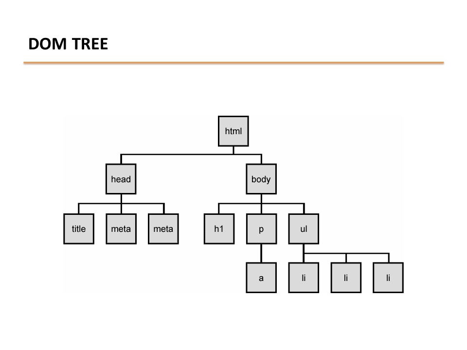

# Events 2

## Goals
* Understand Event Bubbling and Event Delegation
* Know the difference between event.target and event.currentTarget
* Understand and know how to create and Element.
* Know how to append an element and how to remove one.
* Be able to change the class on an element. 

## Keywords

- bubbling
- delegation
- event.stopPropagation()
- event.target
- event.currentTarget
- document.createElement()
- Node.appendChild()
- ChildNode.remove()


### **Context**

*Bubbling* or *Event Delegation* is the name for the way an event moves up the DOM, triggering
every *listener* that is a parent of its *target*, all the way to the
top of the DOM. An event's `.target` property points to the element on which the event occured.

So what does mean? Let's remember that our DOM is a tree of nodes. Think of this picture. 


When an event gets fired it bubbles up the dom / is delegated to the Nodes parent. Events occur whether or not we are specifically listening for them. This means that if we click on one of the li's in the picture, the click would be _experienced_ by the ul, then the body, and finally the html. It's bubbling up. 

This can be helpful with our pages performace. Let's pretend we had a ul with thousands and thousands of li's. If we put a listener on every li we would have a TON of listeners. This could dramatically slow down our program. Instead of doing that, we could use just one listener on the ul. Because of event delegation, whenever any li's were clicked, our ul would know and be able to fire the specific event. 

If we click on the `p` tag who experiences that event? 

<details>
  <summary>
    Solution
  </summary>
  The `p` tag, then the `body`, and finally the `html`. 
</details>

Let's see event delegation in action! Inside your test.html file add the id "unordered-list" to your ul. Add the id "ordered-list" to your ol, and ad the id's "ordered-first" and "ordered-second" It should look something like: 

```html

  <ul id="unordered-list">
    <li id="first">First item!</li>
    <li id="second">Second item!</li>
    <ol id="ordered-list">
      <li id="ordered-first">This is ordered</li>
      <li id="ordered-seconed">So is this!</li>
    </ol>
    <li id="third">Third item!</li>
  </ul>
```

### **document.createElement()**

To build a *new* HTML page element, use the `document.createElement(tag)`
method. This creates a new *HTMLElement* of type `tag`. This is identical
to the type of element object returned by `.getElementById()` or
`.querySelector()`, and you may modify this element by the same properties
and methods.

You may add this element into the DOM with `Node.appendChild()`.

### **Node.appendChild()**

The `.appendChild(node)` method of the *Node* object (and so inherited by
*Element*) will add a new element into the DOM as a child of the calling
element. This is best demonstrated by example.

### **Example: YAPE Duplicator**

Duplicate the files *exYAPE.html* and *exYAPE.js* as *exYAPE-d.html* and
*exYAPE-d.js*. With the new files, every time a list item is clicked,
duplicate that list item with `document.createElement()` and add it to the bottom of the list with `.appendChild()` on the *ul* element.

### **ChildNode.remove()**

You may call the .remove() method on any Node to remove it from the DOM.

### **Other DOM Manipulation Methods**

We won't use these today, but the many other DOM manipulation methods
include:

- `.replaceChild()`
- `.removeChild()`
- `.insertBefore()`
- `.cloneNode()`


## Resources

- [MDN - Event Bubbling and Capture](https://developer.mozilla.org/en-US/docs/Learn/JavaScript/Building_blocks/Events#Event_bubbling_and_capture)
- [MDN - Event.target](https://developer.mozilla.org/en-US/docs/Web/API/Event/target)
- [MDN - Node.appendChild()](https://developer.mozilla.org/en-US/docs/Web/API/Node/appendChild)
- [MDN - ChildNode.remove()](https://developer.mozilla.org/en-US/docs/Web/API/ChildNode/remove)
