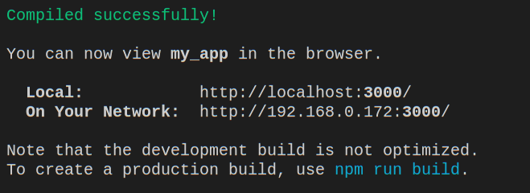
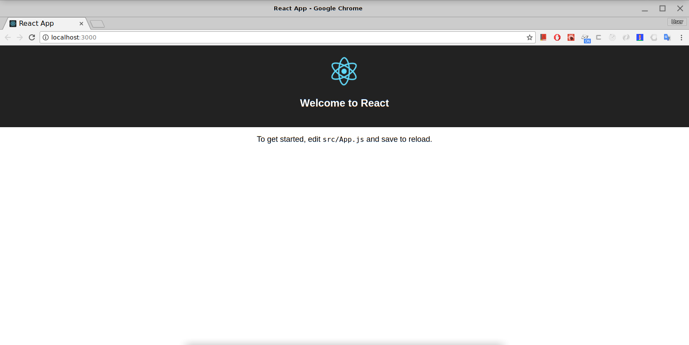
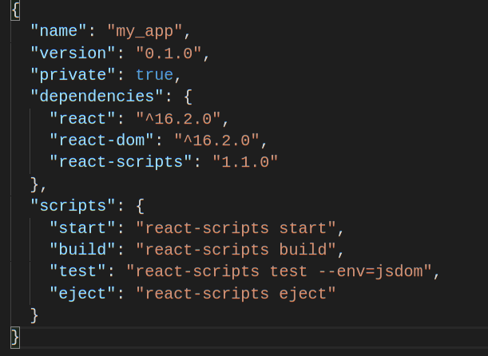

# React - Local Set Up

* [create-react-app](https://github.com/facebookincubator/create-react-app)
* [CodeSandbox](https://codesandbox.io/)

## Lesson

In this lesson you will learn how to set up React locally.

### [create-react-app](https://github.com/facebookincubator/create-react-app)

We will use an npm package called [create-react-app](https://github.com/facebookincubator/create-react-app) to set up React. The first step is to install this pacakge globally:

```bash
npm install -g create-react-app
```

Note the `-g` flag above. When can install a package globally from any directory in the command line.

_note:_ your user must have permission to the directory npm is installed in. This should already be the case. If not, you may see some error when attempting to install a package globally (such as `EACCESS` or `permission denied`)

Once `create-react-app` is installed, you should be able to run the following command from any directory in the command line:

```bash
create-react-app
```

Which should result in an output that looks like this:


To set up a new React project, navigate in the command line to any directory, and execute the command:

```bash
create-react-app [folder name]
```

For example, if you want to set up a new React project in `~/Desktop/my_app`, navigate to `~/Desktop` and run

```bash
create-react-app my_app
```

Following which you should see the output:


Once the installation is complete, open `~/Desktop/my_app` with your editor. The folder structure is as follows:

```bash
- node_modules/
- src/
|  - App.js
|  - index.js
|  - App.css
|  - index.css
- public/
|  - index.html
|  - favicon.ico
- package.json
- README.md
```

For now you can ignore the other files in the `src/` and `public/` directories. You can now start the app with the regular `npm start` command. You should initially see
the output `starting development server` and a little while later:



Now, on opening you web browser on `localhost:3000` (this may happen automatically), you should see the following:



When you save your changes to any of the files in `src/` or to `index.html`, the server and `localhost:3000` will be reloaded automically with the latest changes.

### `package.json`

The project will be initially set up with three pacakges as dependecies: `react`, `react-dom`, and `react-scripts`. You can see those in `package.json`:



While we have already been using `react` and `react-dom`, you likely have not seen `react-scripts` before. This is the package that enables React to run locally. There is a lot going on behind the curtain of `react-scripts` which we will explore at a later time. For now, note that `npm start` actually executes `react-scripts start`. We will also be using the `build` script later on.

### Installing Additional Packages

Use the `npm install` command to install additional packages. For example, to install `react-router-dom`:

```bash
npm install --save react-router-dom
```

Once the installation is complete, you should be able to see the package under `dependencies` in the `package.json` file.

### Downloading your projects from CodeSandbox

Projects are downloaded from CodeSandbox as a single `zip` file. These can be extracted and run in the same way as the projects set up using `create-react-app`. The only difference is that projects downloaded from CodeSandbox will not have the dependencies installed. So after extracting a downloaded project, you will first need to navigate to that project's folder and run `npm install`. This will install the `react`, `react-dom`, `react-scripts` and also any pacakges you have added as dependencies in CodeSandbox. Once installation is complete, you can continue working on the project in the same way as with one set-up with `create-react-app`.

### The Bundle

While developing the app, we use `import` statements, but these are not currently supported by any browser. In fact, when you execute the command `npm start`, the entire code of your app is _bundled_ together into a single `.js` file. You can see this file (called `bundle.js`) in the browser's developer tools under the sources tab:


While the development server is running, the bundle will be rebuilt when you save changes to nearly any of your files.

The contents of `bundle.js` will look unfamiliar. In fact the bundling process can involve several additional steps to simply putting all the code in one file. For one, we have been using both `JSX` code, and other modern javascript code that is not yet supported by any browser. To achieve browser compatibility, the code from your project is translated (or _transpiled_) into `es5`. We will discuss the bundling process in greater depth in the future.

### Source Mapping

Fortunately, the code in the `bundle.js` file is mapped back to our react code. This means that we can step through and debug react code as if it were actually running in the browser. Under the sources tab, you will also find the root directory of your project.

> Activity: Setting breakpoints in a react component.

### Setting Up For Production

The `bundle.js` file created by the development server is temporary, and will not be available once the server is stopped. To deploy (i.e. publish) an app, we will need to run the `build` command:

```bash
npm run build
```

You should see the message: `Creating an optimized production build...`. When the process is done, a `build` directory will be available in the root of the project, which will include following files (along with some others):

```bash
- static/
| - css/
| | - main.[...].css
| | - main.[...].css.map
| - js/
| | - main.[...].js
| | - main.[...].js.map
- index.html
- favicon.ico
```

The `build` folder contains a single `html` file, which links to a single `.js` file and a single `.css` file.
